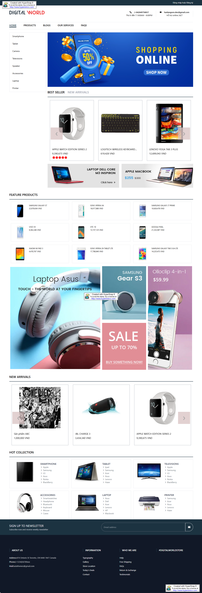
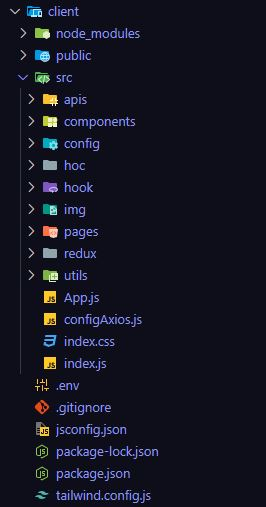
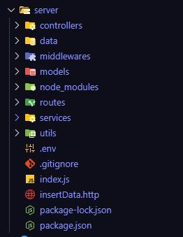

# Electronic Goods Ecommerce App using MERN Stack

###### Last Updated: 06 Feb, 2025

**Electronic Goods E-commerce project** is a great way to showcase your understanding of full-stack development. In this article, we'll walk through the step-by-step process of creating an Electronic Goods E-commerce using the **MERN** (MongoDB, Express.js, React, Node.js) stack. This project will showcase how to set up a full-stack web application where users can view, filter, and purchase various electronic goods.

**Preview of final output:** Let us have a look at how the final application will look like:
</br>
## Technologies Used
- [React JS](https://react.dev/) and [Redux](https://redux.js.org/)
- [MongoDB]([technologies-used](https://www.mongodb.com/docs/)) and  [Mongoose](https://mongoosejs.com/) 
- [Express](https://expressjs.com/)
- [Node JS](https://www.geeksforgeeks.org/node-js-introduction/)


## Features
- User authentication and authorization: Registration and login, user authentication.
- Product browsing and searching: View product list with search and filter tools.
- Shopping cart functionality: Add products to the cart and manage items before checkout.
- Order processing and payment integration: Order processing and payment integration.
- Review and rating system: Product review and rating system.
- Favorite list: Add products to the favorite list.
- Notification system: Notification system for promotions, discounts, and order status updates.

## Installation:
   - Clone repository:
   ```bash
    git clone  https://github.com/haidangsondev/Shop_online
   ```
   - Install necessary packages:
   ```bash
   npm install
   ```
## Setup for Fontend
#### Step 1: Create the .env file and configure the environment variables.
- REACT_APP_API_URL = your_backend_url
- REACT_APP_PRODUCT_LIMIT = your_product_limit
#### Step 2: Run the project.
- npm start
   ```bash
    "start": "react-scripts start"
   ```
- npm run build
  ```bash
    "build": "react-scripts build",
   ```
#### Step 3: Access the system via the following link:
   ```
   http://localhost:3000
   ```
#### Project Structure:
</br>
## Setup for Backend

#### Step 1: Create the .env file and configure the environment variables.
- PORT = 5000
- URL_MONGODB = your_url_mongodb
- URL_SERVER = http://localhost:5000
- URL_CLIENT =  http://localhost:3000
- APP_PASSWORD = your_app_password for email 
- EMAIL_NAME = your_email
- JWT_SECRETKEY = your_jwt_secretkey
- CLOUDINARY_NAME = your_cloudinary_name
- CLOUDINARY_KEY = your_cloudinary_key
- CLOUDINARY_SECRET = your_cloudinary_secret

#### Step 2: Run the project.
- npm run dev
   ```bash
   "dev": "nodemon index.js"
   ```
#### Step 3: Access the system via the following link:
   ```
   http://localhost:5000
   ```
#### Project Structure:
</br>