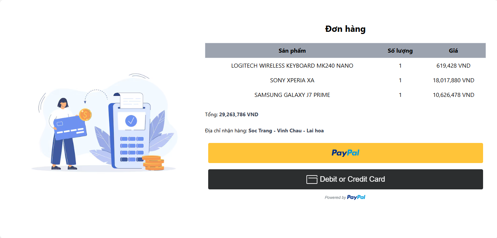
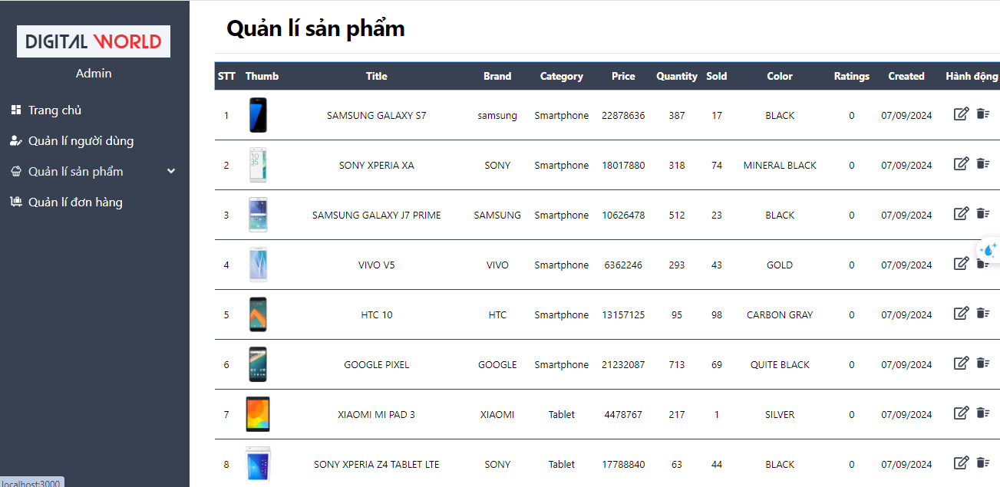

# Dự Án Bán Hàng Điện Tử

## 1. Mô Tả Dự Án

Dự án **Bán Hàng Điện Tử** là hệ thống bán hàng trực tuyến bao gồm cả frontend và backend. Hệ thống cho phép người dùng duyệt sản phẩm, thêm vào giỏ hàng, thanh toán trực tuyến và quản lý thông tin cá nhân. Dự án hỗ trợ các tính năng hiện đại như thanh toán qua PayPal, quản lý đơn hàng, danh sách yêu thích, và quản lý kho hàng. Ngoài ra, dự án cũng cung cấp các tính năng quản lý sản phẩm, người dùng, và đơn hàng một cách toàn diện cho các quản trị viên.


## 2. Tính Năng Chính

### Frontend
- **Trang chủ**: Hiển thị danh sách sản phẩm nổi bật và các chương trình khuyến mãi.
- **Chi tiết sản phẩm**: Xem thông tin chi tiết về sản phẩm, hình ảnh và đánh giá từ người dùng.
- **Giỏ hàng**: Thêm sản phẩm vào giỏ hàng và tiến hành thanh toán.
- **Thanh toán**: Hỗ trợ thanh toán qua PayPal.
- **Quản lý người dùng**: Đăng ký, đăng nhập, và quản lý thông tin cá nhân.
- **Theo dõi đơn hàng**: Xem lịch sử mua hàng và trạng thái đơn hàng.
- **Danh sách yêu thích**: Lưu các sản phẩm yêu thích để xem lại sau.
- **Blog và Dịch vụ**: Xem các bài viết tin tức và dịch vụ hỗ trợ của cửa hàng.
  
  
  
  
### Backend 
- **Quản lý người dùng**: Đăng ký, đăng nhập, quản lý thông tin người dùng.
- **Quản lý sản phẩm**: Thêm, chỉnh sửa, xóa sản phẩm.
- **Quản lý bài viết**: Thêm, chỉnh sửa, xóa bài viết.
- **Quản lý danh mục sản phẩm**: Quản lý các danh mục cho sản phẩm.
- **Quản lý danh mục bài viết**: Quản lý các danh mục cho bài viết.
- **Quản lý mã giảm giá**: Tạo, chỉnh sửa, xóa mã giảm giá.
- **Quản lý đơn hàng**: Theo dõi và quản lý các đơn hàng của khách hàng.
- **Xác thực người dùng**: Sử dụng JWT để xác thực và bảo mật.
  
  
  
  ## 3. Kiến Trúc Hệ Thống
  Hệ thống sử dụng kiến trúc MVC kết hợp với React cho frontend và Node.js cùng Express cho backend. Cơ sở dữ liệu MongoDB được sử dụng để lưu trữ và quản lý dữ liệu.
  ### Fontend 
  
- **Components**: Các thành phần React tái sử dụng như thanh ba, sản phẩm, tìm kiếm, đầu trang, cuối trang,..
- **Pages**: Các trang chính như trang chủ, trang chi tiết sản phẩm, giỏ hàng, trang thanh toán và phân vùng cho mỗi người dùng.
- **Redux**: Quản lý trạng thái toàn cục của ứng dụng như giỏ hàng, thông tin người dùng và sản phẩm.
- **Hook**: Tạo hook riêng để tái sử dụng và các mục đích riêng cho từng chức năng
- **Routes**: Quản lý điều hướng giữa các trang sử dụng `react-router-dom`.
### Backend

- **Models**: Định nghĩa các schema cho người dùng, sản phẩm, danh mục sản phẩm, bài viết, danh mục bài viết, đơn hàng và mã giảm giá.
- **Views**: Sử dụng JSON để trả về dữ liệu cho client (REST API).
- **Controllers**: Xử lý logic nghiệp vụ như quản lý người dùng, sản phẩm, và đơn hàng.
- **Routes**: Định tuyến các API liên quan đến người dùng, sản phẩm, đơn hàng.
- **Middlewares**: Xử lý xác thực JWT, phân quyền và quản lý lỗi.

## 4. Công Nghệ Sử Dụng

### Fontend 

- **Ngôn ngữ lập trình**: JavaScript
- **Thư viện**: React.js
- **Quản lý trạng thái**: Redux
- **Giao diện**: TailwindCSS
- **Thư viện hỗ trợ**:
  - **Axios**: Giao tiếp với backend để thực hiện các yêu cầu HTTP.
  - **React**: Thư viện chính để xây dựng giao diện người dùng.
  - **React-DOM**: Thư viện cho phép tương tác với DOM trong ứng dụng React.
  - **React-Router-DOM**: Quản lý điều hướng giữa các trang trong ứng dụng.
  - **React-Redux**: Quản lý trạng thái ứng dụng toàn cục.
  - **@reduxjs/toolkit**: Cung cấp các công cụ và phương pháp tối ưu cho việc xây dựng Redux.
  - **React-Hook-Form**: Quản lý và xác thực các biểu mẫu trong ứng dụng.
  - **SweetAlert2**: Hiển thị cảnh báo và thông báo đẹp mắt.
  - **React-Toastify**: Hiển thị thông báo thành công hoặc lỗi cho người dùng.
  - **Dompurify**: Làm sạch HTML để bảo vệ ứng dụng khỏi các tấn công XSS.
  - **Moment.js**: Xử lý và định dạng thời gian.
  - **React-Image-Magnify**: Tăng cường trải nghiệm xem hình ảnh sản phẩm.
  - **React-Masonry-CSS**: Hiển thị các sản phẩm theo kiểu lưới.
  - **React-Slick**: Thư viện tạo slider cho hình ảnh và sản phẩm
   ..........................

### Backend 
- **Ngôn ngữ lập trình**: Node.js
- **Framework**: Express.js
- **Cơ sở dữ liệu**: MongoDB
- **Thư viện hỗ trợ**:
  - bcrypt (Mã hóa mật khẩu)
  - Cloudinary (Lưu trữ đám mây cho hình ảnh và video)
  - cookie-parser (Phân tích và quản lý cookies)
  - CORS (Hỗ trợ yêu cầu giữa các nguồn gốc khác nhau)
  - dotenv (Quản lý biến môi trường)
  - Express (Framework cho Node.js)
  - express-async-handler (Xử lý lỗi không đồng bộ)
  - JWT (JSON Web Token cho xác thực)
  - MongoDB (Cơ sở dữ liệu NoSQL)
  - Mongoose (ORM cho MongoDB)
  - Multer (Middleware cho việc tải file)
  - multer-storage-cloudinary (Lưu trữ tệp trên Cloudinary)
  - Nodemailer (Gửi email)
  - Slugify (Chuyển đổi chuỗi thành slug)
  - uniqid (Tạo ID ngẫu nhiên duy nhất)
  
## 5. Hướng Dẫn Cài Đặt

### Các bước để cài đặt và chạy dự án:
1. Clone repository:
   ```bash
    git clone  https://github.com/haidangsondev/Shop_online
   ```
2. Cài đặt các gói cần thiết:
   ```bash
   npm install
   ```
### Fontend 
1. Tạo file `.env` và cấu hình các biến môi trường:
- REACT_APP_API_URL = your_backend_url
- REACT_APP_PRODUCT_LIMIT = your_product_limit


2. Chạy dự án:
- npm start
   ```bash
    "start": "react-scripts start"
   ```
- npm run build
  ```bash
    "build": "react-scripts build",
   ```
3. Truy cập hệ thống qua đường dẫn:
   ```
   http://localhost:3000
   ```
### Backend 
1. Tạo file `.env` và cấu hình các biến môi trường:
- PORT = 5000
- URL_MONGODB = your_url_mongodb
- URL_SERVER = http://localhost:5000
- URL_CLIENT =  http://localhost:3000
- APP_PASSWORD = your_app_password for email 
- EMAIL_NAME = your_email
- JWT_SECRETKEY = your_jwt_secretkey
- CLOUDINARY_NAME = your_cloudinary_name
- CLOUDINARY_KEY = your_cloudinary_key
- CLOUDINARY_SECRET = your_cloudinary_secret

2. Chạy dự án:
- npm run dev
   ```bash
   "dev": "nodemon index.js"
   ```
3. Truy cập hệ thống qua đường dẫn:
   ```
   http://localhost:5000
   ```

## 6. Kết Luận
Dự án Bán Hàng Điện Tử cung cấp một hệ thống bán hàng trực tuyến toàn diện, từ giao diện người dùng thân thiện, các tính năng quản lý sản phẩm, đơn hàng, đến tích hợp thanh toán trực tuyến an toàn. Hệ thống giúp doanh nghiệp dễ dàng mở rộng và tích hợp thêm các tính năng như phân tích dữ liệu, báo cáo doanh thu, và chatbot hỗ trợ khách hàng trong tương lai.