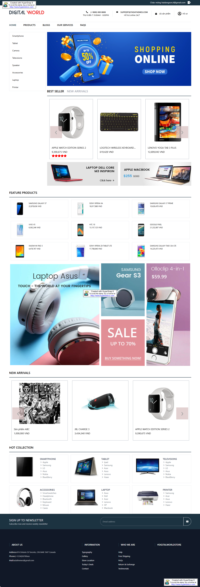
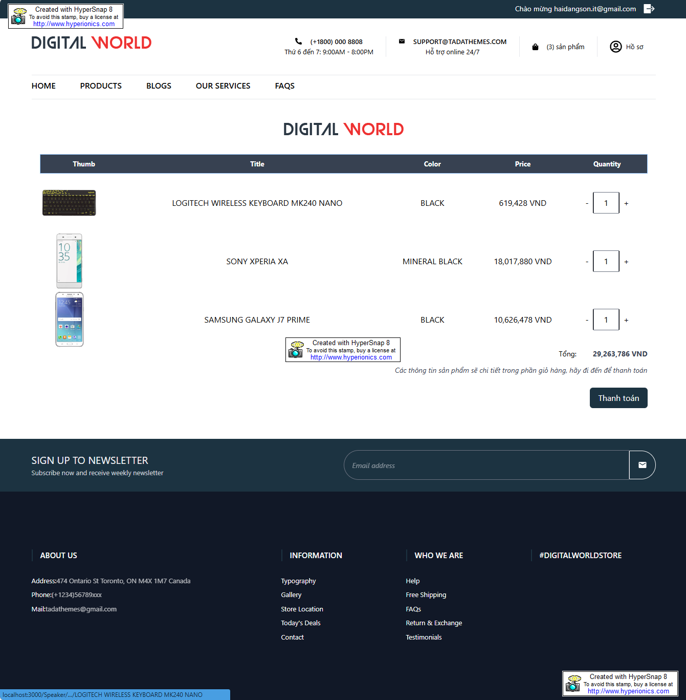

# Dự Án Bán Hàng Điện Tử - Fontend

## 1. Mô Tả Dự Án

Dự án **Bán Hàng Điện Tử - Fontend** là phần giao diện người dùng của hệ thống bán hàng trực tuyến. Dự án cung cấp một trang web cho khách hàng có thể duyệt sản phẩm, thêm vào giỏ hàng, thanh toán trực tuyến, và quản lý thông tin cá nhân. Hệ thống hỗ trợ nhiều tính năng hiện đại như thanh toán qua PayPal, hiển thị chi tiết sản phẩm, quản lý đơn hàng, và danh sách yêu thích.

## 2. Tính Năng Chính

- **Trang chủ**: Hiển thị danh sách sản phẩm nổi bật và các chương trình khuyến mãi.
 
- **Chi tiết sản phẩm**: Xem thông tin chi tiết về sản phẩm, hình ảnh và đánh giá từ người dùng.
  
- **Giỏ hàng**: Thêm sản phẩm vào giỏ hàng và tiến hành thanh toán.
  
- **Thanh toán**: Hỗ trợ thanh toán qua PayPal.
- **Quản lý người dùng**: Đăng ký, đăng nhập, và quản lý thông tin cá nhân.
- **Theo dõi đơn hàng**: Xem lịch sử mua hàng và trạng thái đơn hàng.
- **Danh sách yêu thích**: Lưu các sản phẩm yêu thích để xem lại sau.
- **Blog và Dịch vụ**: Xem các bài viết tin tức và dịch vụ hỗ trợ của cửa hàng.

## 3. Kiến Trúc Hệ Thống

Dự án sử dụng React để xây dựng giao diện người dùng, Redux để quản lý trạng thái ứng dụng, và TailwindCSS để tạo giao diện linh hoạt và dễ tùy chỉnh.

- **Components**: Các thành phần React tái sử dụng như thanh ba, sản phẩm, tìm kiếm, đầu trang, cuối trang,..
- **Pages**: Các trang chính như trang chủ, trang chi tiết sản phẩm, giỏ hàng, trang thanh toán và phân vùng cho mỗi người dùng.
- **Redux**: Quản lý trạng thái toàn cục của ứng dụng như giỏ hàng, thông tin người dùng và sản phẩm.
- **Hook**: Tạo hook riêng để tái sử dụng và các mục đích riêng cho từng chức năng
- **Routes**: Quản lý điều hướng giữa các trang sử dụng `react-router-dom`.

## 4. Công Nghệ Sử Dụng

- **Ngôn ngữ lập trình**: JavaScript
- **Thư viện**: React.js
- **Quản lý trạng thái**: Redux
- **Giao diện**: TailwindCSS
- **Thư viện hỗ trợ**:
  - **Axios**: Giao tiếp với backend để thực hiện các yêu cầu HTTP.
  - **React**: Thư viện chính để xây dựng giao diện người dùng.
  - **React-DOM**: Thư viện cho phép tương tác với DOM trong ứng dụng React.
  - **React-Router-DOM**: Quản lý điều hướng giữa các trang trong ứng dụng.
  - **React-Redux**: Quản lý trạng thái ứng dụng toàn cục.
  - **@reduxjs/toolkit**: Cung cấp các công cụ và phương pháp tối ưu cho việc xây dựng Redux.
  - **React-Hook-Form**: Quản lý và xác thực các biểu mẫu trong ứng dụng.
  - **SweetAlert2**: Hiển thị cảnh báo và thông báo đẹp mắt.
  - **React-Toastify**: Hiển thị thông báo thành công hoặc lỗi cho người dùng.
  - **Dompurify**: Làm sạch HTML để bảo vệ ứng dụng khỏi các tấn công XSS.
  - **Moment.js**: Xử lý và định dạng thời gian.
  - **React-Image-Magnify**: Tăng cường trải nghiệm xem hình ảnh sản phẩm.
  - **React-Masonry-CSS**: Hiển thị các sản phẩm theo kiểu lưới.
  - **React-Slick**: Thư viện tạo slider cho hình ảnh và sản phẩm.
  - **React-Select**: Tạo các dropdown chọn lựa nâng cao.
  - **@paypal/react-paypal-js**: Tích hợp thanh toán qua PayPal.
  - **@testing-library/react**: Thư viện kiểm thử cho các thành phần React.
  - **@testing-library/jest-dom**: Cung cấp các phương thức bổ sung cho việc kiểm thử DOM.
  - **@testing-library/user-event**: Mô phỏng hành động của người dùng trong kiểm thử.
  - **@tinymce/tinymce-react**: Trình soạn thảo văn bản WYSIWYG cho việc nhập nội dung.
  - **clsx**: Kết hợp nhiều lớp CSS trong React.
  - **redux-persist**: Giúp lưu trữ trạng thái Redux để giữ lại khi tải lại trang.
  - **slick-carousel**: Thư viện cho việc tạo carousel và slider.
  - **use-react-router-breadcrumbs**: Tạo breadcrumbs cho ứng dụng dựa trên điều hướng.
  - **web-vitals**: Theo dõi hiệu suất và chất lượng của ứng dụng.
  - **dotenv**: Quản lý biến môi trường cho ứng dụng.
  - **@tailwindcss/forms**: Tùy chỉnh và tối ưu hóa các thành phần form trong TailwindCSS.
  - TailwindCSS (Thiết kế giao diện)


## 5. Hướng Dẫn Cài Đặt

### Các bước để cài đặt và chạy dự án:
1. Clone repository:
   ```bash
   git clone [link repository]
   ```
2. Cài đặt các gói cần thiết:
   ```bash
   npm install
   ```
3. Tạo file `.env` và cấu hình các biến môi trường:
- REACT_APP_API_URL = your_backend_url
- REACT_APP_PRODUCT_LIMIT = your_product_limit


4. Chạy dự án:
- npm start
   ```bash
    "start": "react-scripts start"
   ```
- npm run build
  ```bash
    "build": "react-scripts build",
   ```
5. Truy cập hệ thống qua đường dẫn:
   ```
   http://localhost:3000
   ```

## 6. Kết luận 
Dự án Bán Hàng Điện Tử - Client mang đến trải nghiệm người dùng thân thiện và tích hợp nhiều tính năng hiện đại cho việc mua sắm trực tuyến. Giao diện đơn giản, dễ sử dụng, và hệ thống thanh toán trực tuyến an toàn giúp cải thiện hiệu suất và sự hài lòng của người dùng. Trong tương lai, dự án có thể được mở rộng thêm các tính năng như đề xuất sản phẩm, hỗ trợ chatbot, và tích hợp thêm nhiều cổng thanh toán khác để đáp ứng nhu cầu đa dạng của khách hàng.